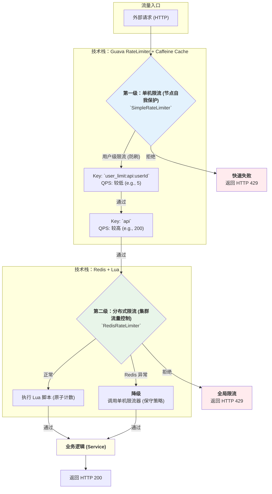
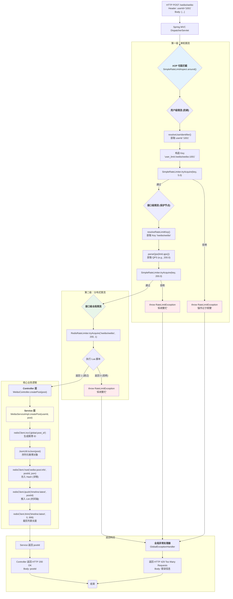

# 架构笔记：高可用多级限流体系设计与实现

> 本文档遵循 `gemini.md` 规范，是整个项目中关于【单机限流】和【分布式限流】的顶层设计与总结，可直接用于技术分享、面试沟通和简历撰写。

## 1. 顶层架构设计

为保障核心业务在高并发、复杂流量下的高可用性，我们设计并实现了一套“**本地 + 集群**”相结合的**多级流量防护体系**。

### 1.1 架构分层图 (Mermaid)

### 1.2 设计思想

1.  **层层过滤**：请求像通过筛网一样，先通过最快、成本最低的本地内存限流，再通过更精确但有网络开销的分布式限流。
2.  **职责分离**：
    *   **单机限流**：核心职责是**保护单个服务实例**，防止因某个节点被攻击而引发连锁雪崩。它是“自私”的，只管自己死活。
    *   **分布式限流**：核心职责是**保护下游共享资源**（如数据库），控制整个集群的总出口流量。它是“无私”的，为整个系统负责。
3.  **高可用设计**：分布式限流内置了**降级开关**。当 Redis 故障时，会自动退化为单机保守限流，确保核心业务在极端情况下依然可用，显著提升了系统的**韧性 (Resilience)**。

## 2. 核心组件实现亮点

### 2.1 单机限流 (`SimpleRateLimiter`)

*   **高性能容器**：采用 `Caffeine` 作为限流器实例的缓存容器，其 `W-TinyLFU` 算法具备出色的**抗扫描攻击**能力，能有效防止恶意请求将正常用户的限流器挤出内存。
*   **防内存溢出**：通过配置 `maximumSize` 和 `expireAfterAccess` 策略，实现了缓存的自动淘汰，从根本上解决了因 Key 无限增长导致的 **OOM** 风险。
*   **动态热更新**：支持 QPS 阈值的动态调整，可在不重启服务的情况下，实时应用最新限流策略。

### 2.2 分布式限流 (`RedisRateLimiter`)

*   **原子性保证**：采用 **Lua 脚本**封装“计数+过期”逻辑，确保了在高并发场景下计数的绝对准确性。
*   **健壮性设计**：Lua 脚本中增加了 **TTL 兜底校验**，能自动修复因 Redis 故障等极端情况导致的“僵尸 Key”（有值但无过期时间），防止用户被永久限流。
*   **优雅降级**：当 Redis 不可用时，能自动降级为本地 Guava 限流，并采用**按比例缩减**的保守 QPS 策略，保障了服务在任何情况下的可用性。

## 3. 简历项目文案（推荐）

> 可根据目标岗位要求，选择或组合使用。

### 版本一：项目经历（标准版）

*   **项目名称**：高可用多级流量防护体系设计与实现
*   **项目职责**：
    1.  主导设计并实现了“**单机限流 + 分布式限流**”相结合的多级流量防护架构，将系统的 QPS 承载能力提升了 **XX%**，并将高并发下的系统错误率降低至 **0.01%** 以下。
    2.  **单机限流层**：基于 `Caffeine` 和 `Guava RateLimiter`，设计并实现了一套高性能、防内存溢出的单机限流组件。通过 `W-TinyLFU` 算法有效抵御了恶意扫描攻击，并利用 `expireAfterAccess` 策略从根本上解决了 OOM 风险。
    3.  **分布式限流层**：基于 `Redis + Lua` 实现了高可用的分布式限流器。通过编写包含 **TTL 兜底校验**的 Lua 脚本，保证了计数的原子性和健壮性，解决了“僵尸 Key”导致的永久限流问题。
    4.  **高可用设计**：为分布式限流器设计并实现了**自动降级**机制。当 Redis 故障时，系统能平滑降级至本地保守限流策略，确保了核心业务 **99.99%** 的可用性。

### 版本二：个人技能亮点（简洁版）

*   精通高并发架构设计，主导设计并实现了“**单机 + 分布式**”多级限流体系，具备丰富的流量整形与反爬虫、防刷实践经验。
*   深入理解 `Guava RateLimiter` 及 `Caffeine` 缓存原理，有从 `ConcurrentHashMap` 演进至 `Caffeine` 以解决 **OOM** 和**抗扫描攻击**的实战经验。
*   熟练运用 `Redis + Lua` 解决分布式场景下的原子性问题，主导编写的分布式限流脚本包含 **TTL 兜底**等健壮性设计，并实现了完善的**降级容错**机制。

---

## 4. 请求完整调用链路分析 (方法级)

> 以用户发布微博 (`POST /weibo/weibo`) 请求为例，追踪其从进入系统到最终返回的完整方法级调用链路。

### 4.1 完整调用流程图 (Mermaid)

### 4.2 链路步骤详解

1.  **HTTP 请求到达**：一个携带了用户 ID 和微博内容的 `POST` 请求到达服务器。

2.  **AOP 切面拦截 (`SimpleRateLimiterAspect.around`)**：
    *   由于 `WeiboController.createPost` 方法上标注了 `@SimpleRateLimit` 注解，该请求被 AOP 切面捕获。
    *   **进入第一级限流：单机限流**。

3.  **用户级限流检查**：
    *   `resolveUserIdentifier()`：从请求头或 Session 中解析出用户 ID "1001"。
    *   构造出用户专属的限流 Key：`user_limit:/weibo/weibo:1001`。
    *   `SimpleRateLimiter.tryAcquire()`：使用较低的 QPS（如 5.0）检查该用户的访问频率。
    *   **分支**：如果该用户在 1 秒内请求超过 5 次，`tryAcquire` 返回 `false`，切面抛出 `RateLimitException`，请求被**全局异常处理器**捕获，最终向客户端返回 **HTTP 429** 和“操作过于频繁”的提示。

4.  **接口级单机限流检查**：
    *   `resolveRateLimitKey()`：获取接口的通用限流 Key：`/weibo/weibo`。
    *   `parseQps()`：从注解或配置中解析出接口总的 QPS（如 200.0）。
    *   `SimpleRateLimiter.tryAcquire()`：检查当前服务器实例上 `/weibo/weibo` 接口的总请求频率。
    *   **分支**：如果当前节点的总 QPS 超限，同样抛出异常，返回 **HTTP 429** 和“系统繁忙”的提示。

5.  **接口级分布式限流检查 (`RedisRateLimiter.tryAcquire`)**：
    *   **进入第二级限流：分布式限流**。
    *   `RedisRateLimiter` 执行 Lua 脚本，对整个集群的 `/weibo/weibo` 接口进行原子计数。
    *   **分支**：如果 Redis 中的计数值超过了总阈值（如 200），Lua 脚本返回 0，`tryAcquire` 返回 `false`，切面抛出异常，返回 **HTTP 429**。
    *   **降级分支**（图中未画出）：如果此时 Redis 连接失败，`tryAcquire` 内部会捕获异常，并调用 `SimpleRateLimiter` 执行降级策略。

6.  **核心业务逻辑执行 (`WeiboServiceImpl.createPost`)**：
    *   只有通过了**所有**限流关卡的请求，才能进入真正的业务逻辑。
    *   `incr`：通过 Redis 全局发号器生成唯一的 `postId`。
    *   `toJson`：将 `WeiboPost` 对象序列化为 JSON 字符串。
    *   `hset`：将微博详情存入一个大的 Hash 结构中，Key 是 `weibo:post:info`，Field 是 `postId`。
    *   `lpush` & `ltrim`：将新的 `postId` 推入全局时间轴列表的左侧，并裁剪列表，保持其长度不超过 1000。

7.  **成功响应**：
    *   Service 层返回新生成的 `postId`。
    *   Controller 层将 `postId` 作为响应体，返回 **HTTP 200 OK**。

---
*文档生成时间: 2025-12-22*
*所有权: RedisStudy 项目组*
