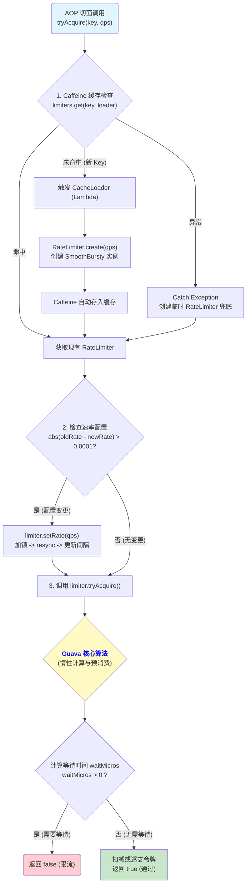

# 架构笔记：高性能单机限流器 (Guava + Caffeine)

> 本文档遵循 `gemini.md` 规范，基于项目中的 `SimpleRateLimiter` 实现，深度解析其设计思想、核心原理与真实调用链路。

## 1. 组件设计解析

### 1.1 类职责 (Class Responsibility)

`SimpleRateLimiter` 负责为**单个服务节点**提供**纯内存**的、**低延迟**的令牌桶限流能力。

### 1.2 设计目的 (Design Purpose)

1.  **节点自我保护**：在流量入口处对当前服务实例进行前置保护，防止因突发流量或下游服务故障导致自身资源耗尽而崩溃。
2.  **快速失败 (Fail-Fast)**：对于超出单机处理能力的请求，在纳秒级时间内快速拒绝，避免不必要的线程等待和资源消耗。
3.  **降级兜底**：作为多级防护体系的最后一道防线，在分布式限流组件（如 Redis）不可用时，保证服务节点依然具备基础的限流能力，不会“裸奔”。

### 1.3 为什么需要该类 (Why is it needed?)

在分布式系统中，仅有全局限流是不够的。单机限流是保障单个服务实例（Pod/VM）稳定性的基石。它能有效防止雪崩效应，是构建高可用、高韧性系统的标准实践。

### 1.4 核心实现思路 (Core Implementation)

1.  **算法核心**：采用 Google Guava 的 `RateLimiter` (`SmoothBursty` 模式) 作为令牌桶算法的实现。该模式允许短时突发流量，能提供更平滑的用户体验。
2.  **容器优化**：**弃用 `ConcurrentHashMap`**，采用业界领先的本地缓存组件 `Caffeine` 来存储限流器实例。
    *   **防内存溢出**：通过 `maximumSize` 和 `expireAfterAccess` 策略，自动淘汰不活跃的限流器，从根本上解决了因限流 Key 无限增长导致的 OOM 风险。
    *   **抗扫描攻击**：Caffeine 的 `W-TinyLFU` 算法能有效识别并拒绝低频的“垃圾 Key”（如恶意扫描）进入主缓存区，保护了正常用户的限流器实例不被污染。
3.  **动态配置**：支持 QPS 阈值的**动态热更新**。通过在每次请求时比对速率，实现了在不重启服务的情况下，实时调整限流策略。
4.  **依赖注入**：将 `Caffeine` 实例作为 `Bean` 在 `CacheConfig` 中统一配置，由 Spring 容器注入到 `SimpleRateLimiter` 中，实现了配置与业务的解耦。

## 2. 真实调用流程图 (Mermaid)

该流程图展示了从 AOP 切面调用到最终返回结果的完整链路。

## 3. Guava RateLimiter 核心原理

*   **惰性计算**：无后台线程，仅在请求时根据时间差计算并补充令牌。
*   **预消费**：允许突发流量“透支”未来的令牌，自身立即通过，但将等待成本转移给后续请求。
*   **`SmoothBursty`**：默认模式，桶内积攒的令牌（`storedPermits`）可用于无等待地处理突发流量，超出库存后则严格按 QPS 速率平滑放行。

---
*文档生成时间: 2025-12-22*
*所有权: RedisStudy 项目组*
