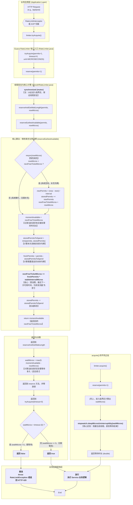

# Guava RateLimiter 令牌桶限流原理深度解析

> 本文档基于真实项目中的单机限流实现（`SimpleRateLimiter`），深入剖析 Guava `RateLimiter` 的核心调用流程、设计哲学及关键源码逻辑。

## 1. 核心调用流程图 (Mermaid)

该流程图展示了从业务层调用 `tryAcquire` 到 Guava 内部核心算法的完整路径，涵盖了线程安全、惰性填充、预消费及结果判定等关键环节。

## 2. 核心原理深度解析

### 2.1 `tryAcquire()` 与 `acquire()` 的本质区别

*   **`tryAcquire()` (非阻塞 - 试探)**
    *   **行为**：它在内部计算出需要等待的时间 `waitMicros` 后，会立即与传入的 `timeout`（无参版本为 0）进行比较。
    *   **结果**：
        *   如果 `waitMicros > timeout`：**直接返回 `false`**。**关键点**：此时**不会**执行任何扣减库存或推后 `nextFreeTicketMicros` 的操作，状态完全回滚，就像请求没来过一样。
        *   如果 `waitMicros <= timeout`：返回 `true`，并真正执行扣减和推后操作。
    *   **适用场景**：API 接口限流、快速失败场景。

*   **`acquire()` (阻塞 - 承诺)**
    *   **行为**：它同样计算出 `waitMicros`。如果 `waitMicros > 0`，它会调用 `Thread.sleep` **阻塞当前线程**，直到等待结束。
    *   **结果**：总是返回成功（除非被中断），代价是线程被挂起。
    *   **适用场景**：后台任务、数据同步、必须执行的任务。

### 2.2 为什么 Guava 能支持“突发流量”？

这是由 **“预消费 (Pre-consumption)”** 和 **“库存 (storedPermits)”** 机制共同决定的。

1.  **库存应对小突发**：
    *   当系统空闲时，`resync` 机制会利用时间差计算并累积 `storedPermits`（默认最多存 1 秒的量）。
    *   当一小波突发流量到来时，可以直接消耗这些库存令牌，无需等待，实现快速响应。

2.  **预消费应对大突发**：
    *   当突发流量大到库存也无法满足时，Guava 允许 **“透支未来”**。
    *   **机制**：当前请求需要的令牌数 `permits`，即使远大于库存，Guava 也会让这个请求**立即通过**（`waitMicros = 0`）。
    *   **代价**：它会把 `nextFreeTicketMicros` 这个时间点**向未来推后** `(permits - storedPermits) * interval` 的时间。
    *   **效果**：当前的突发请求几乎 0 等待通过，但它把等待的成本**转移**给了紧随其后的请求（后人还债）。这就是为什么它能“扛住”突发。

### 2.3 为什么它是“平滑限流”？

“平滑”指的是**令牌生成（即请求被放行）的速率是稳定且均匀的**，即使在突发流量之后也是如此。

1.  **恒定的放行节奏**：
    *   `stableIntervalMicros` (即 `1.0 / QPS`) 是一个恒定值。
    *   在系统稳定运行（即库存耗尽）时，`nextFreeTicketMicros` 每次被更新时，都是精确地增加一个 `interval` 的倍数。
    *   这意味着，请求被放行的时间点是严格按照 QPS 设定的节奏来的，像节拍器一样稳定。

2.  **突发后的“拉平”效应**：
    *   当一个大突发（比如一次性 `acquire(100)`）发生后，`nextFreeTicketMicros` 被推到了很远的未来。
    *   后续的请求会发现需要等待很长时间。但这些后续请求依然是**一个一个**地、按照 `stableIntervalMicros` 的间隔排队等待。
    *   **宏观效果**：限流器把一个巨大的流量尖峰，“平滑”地拉成了一条长长的、速率恒定的直线。

## 3. 关键源码变量对照

| 变量名 | 含义 | 作用 |
| :--- | :--- | :--- |
| `storedPermits` | 库存令牌数 | 应对小规模突发，系统空闲时累积。 |
| `nextFreeTicketMicros` | 下一次可用时间 | **核心变量**。记录了还清所有“债务”的时间点。 |
| `stableIntervalMicros` | 稳定间隔 | `1 / QPS`。决定了平滑放行的节奏。 |
| `nowMicros` | 当前时间 | 用于计算空闲时长和等待时长。 |

## 4. 总结

Guava RateLimiter 通过 **“惰性计算”** 实现了高性能（无后台线程），通过 **“库存+预消费”** 支持了突发流量，又通过 **“恒定间隔的顺延”** 实现了流量的平滑整形。这是一个在工程实践中设计得极为精妙的典范。
