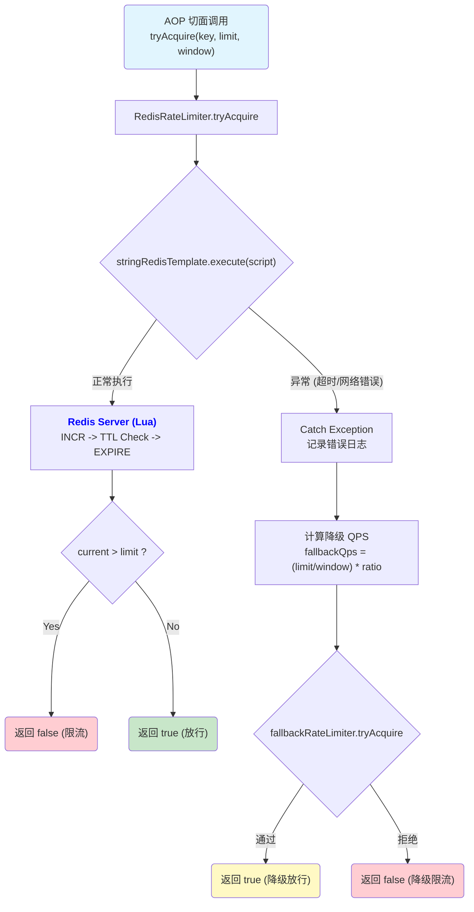

# 架构笔记：高可用分布式限流器 (Redis + Lua)

> 本文档遵循 `gemini.md` 规范，基于项目中的 `RedisRateLimiter` 实现，深度解析其设计思想、Lua 脚本逻辑与容错机制。

## 1. 组件设计解析

### 1.1 类职责 (Class Responsibility)

`RedisRateLimiter` 负责提供**集群级别**的、**强一致性**的流量控制能力。

### 1.2 设计目的 (Design Purpose)

1.  **全局流量控制**：控制整个服务集群对某个资源的总访问频率，防止下游服务（如数据库、第三方 API）过载。
2.  **原子性保障**：利用 Redis Lua 脚本的原子性，解决高并发下的“读取-计算-写入”竞态问题，确保计数准确。
3.  **高可用容错**：设计了完善的**降级机制**。当 Redis 服务不可用时，能自动切换到本地保守限流，确保业务核心流程不中断。

### 1.3 为什么需要该类 (Why is it needed?)

单机限流无法感知集群总流量。在微服务架构中，必须有一个中心化的组件来协调所有节点的访问速率，Redis 是实现这一目标的最佳选择。

### 1.4 核心实现思路 (Core Implementation)

1.  **算法选型**：采用**固定窗口计数器**算法。虽然简单，但其内存占用极低（仅需维护一个 Key），且通过 Lua 脚本执行效率极高，非常适合大规模分布式场景。
2.  **Lua 脚本优化**：
    *   **原子执行**：将 `INCR` 和 `EXPIRE` 打包执行，避免了并发导致的计数错误。
    *   **僵尸 Key 防护**：在脚本中增加了 **TTL 兜底校验**。即使因极端情况导致 Key 丢失了过期时间，下一次请求也会自动补上，彻底消除了用户被永久封禁的风险。
3.  **降级策略**：
    *   捕获所有 Redis 执行异常。
    *   一旦异常，立即调用 `fallbackRateLimiter`（基于 Guava 的单机限流器）。
    *   使用独立的降级 Key 前缀（`redis_fallback:`）和按比例折算的 QPS，确保降级后的流量可控。

## 2. Lua 脚本源码深度解析

这是本实现的核心，我们来逐行拆解它的逻辑。

```lua
-- 1. 获取传入的参数
local key = KEYS[1]                       -- 限流的唯一标识 (e.g., "rate_limit:/api/post")
local limit = tonumber(ARGV[1])           -- 限流阈值 (QPS)
local window = tonumber(ARGV[2])          -- 时间窗口 (秒)

-- 2. 执行计数并获取当前值
-- redis.call('INCR', key) 会原子性地将 key 的值加 1
-- 如果 key 不存在，会先初始化为 0 再加 1
local current = redis.call('INCR', key)

-- 3. 设置过期时间 (包含僵尸 Key 防护)
-- 场景 A: current == 1 (新窗口的第一个请求) -> 设置过期时间
-- 场景 B: redis.call('TTL', key) == -1 (Key 存在但没有过期时间，即僵尸 Key) -> 补上过期时间
if current == 1 or redis.call('TTL', key) == -1 then
    redis.call('EXPIRE', key, window)
end

-- 4. 判断是否超限
if current > limit then
    -- 如果当前计数超过阈值，返回 0 (拒绝)
    return 0
end

-- 5. 返回结果
-- 计数未超限，返回 1 (允许)
return 1
```

## 3. 真实调用流程图 (Mermaid)

该图展示了从 Java 调用到 Redis 执行，再到降级处理的完整链路。



---
*文档生成时间: 2025-12-22*
*所有权: RedisStudy 项目组*
