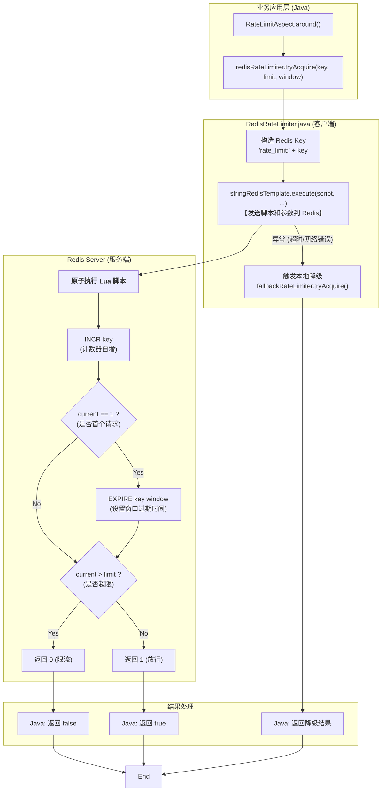

# 分布式限流：Redis + Lua 实现深度解析

> 本文档基于真实项目中的 `RedisRateLimiter` 实现，深入剖析基于 Redis 和 Lua 脚本构建的高性能分布式令牌桶限流方案。

## 1. 核心设计理念

### 1.1 为什么选择 Redis + Lua？

在分布式环境中，多个服务实例需要对同一个资源进行总流量控制，这就必须依赖一个共享的、集中的存储。Redis 因其高性能、单线程执行命令的特性，成为实现分布式锁和限流的理想选择。

但是，单纯使用多个 Redis 命令（如 `GET` -> 计算 -> `SET`）来实现限流，会存在**竞态条件 (Race Condition)**。在高并发下，多个线程可能同时读取到旧的令牌数，导致限流结果不准确。

**Lua 脚本解决了这个问题**：
*   **原子性 (Atomicity)**：Redis 会将整个 Lua 脚本作为一个**不可分割的整体**来执行，执行期间不会被其他任何命令打断。这从根本上保证了“读取、计算、写入”这一系列操作的原子性。
*   **减少网络开销**：将多个命令打包成一个脚本发送给 Redis，减少了客户端与 Redis 之间的网络往返次数 (RTT)，在高频调用下性能优势明显。

### 1.2 算法选型：固定窗口计数器

本项目采用的是**固定窗口计数器算法**，这是最简单高效的分布式限流实现。

*   **原理**：
    *   为每个限流 Key 维护一个计数器。
    *   当第一个请求到达时，初始化计数器并设置过期时间（窗口大小）。
    *   后续请求使计数器自增。
    *   如果计数器超过阈值，则拒绝请求。
*   **优势**：实现简单，内存占用极低（Redis 中只需维护一个 Key）。
*   **劣势**：存在“临界突发”问题（即在窗口切换瞬间可能通过双倍流量），但在大多数业务场景下可接受。

## 2. Lua 脚本源码深度解析

这是本实现的核心，我们来逐行拆解它的逻辑。

```lua
-- 1. 获取传入的参数
local key = KEYS[1]                       -- 限流的唯一标识 (e.g., "rate_limit:/api/post")
local limit = tonumber(ARGV[1])           -- 限流阈值 (QPS)
local window = tonumber(ARGV[2])          -- 时间窗口 (秒)

-- 2. 执行计数并获取当前值
-- redis.call('INCR', key) 会原子性地将 key 的值加 1
-- 如果 key 不存在，会先初始化为 0 再加 1
local current = redis.call('INCR', key)

-- 3. 设置过期时间 (仅在第一次创建时)
if current == 1 then
    -- 如果是该窗口内的第一个请求，设置过期时间
    -- 这样 key 会在窗口结束后自动删除，实现窗口重置
    redis.call('EXPIRE', key, window)
end

-- 4. 判断是否超限
if current > limit then
    -- 如果当前计数超过阈值，返回 0 (拒绝)
    return 0
end

-- 5. 返回结果
-- 计数未超限，返回 1 (允许)
return 1
```

## 3. Java 调用流程图 (Mermaid)

该图展示了从 `RedisRateLimiter.tryAcquire` 方法发起调用，到执行 Lua 脚本，再到返回结果的完整链路。



## 4. 关键设计解析

### 4.1 容错与降级机制

在分布式系统中，Redis 服务可能会出现抖动或不可用。为了防止因限流组件故障导致整个业务不可用，`RedisRateLimiter` 设计了完善的降级机制。

*   **异常捕获**：在 `tryAcquire` 中捕获所有 Redis 执行异常（如 `RedisConnectionException`, `QueryTimeoutException`）。
*   **本地兜底**：一旦 Redis 异常，立即切换到 `fallbackRateLimiter`（基于 Guava 的单机限流器）。
*   **降级策略**：
    *   **降级比例**：通过 `redisFallbackRatio` 配置降级后的 QPS 比例（默认 0.5）。例如原限流 100，降级后单机限流 50。
    *   **隔离 Key**：使用 `redis_fallback:` 前缀构造独立的降级 Key，避免与正常单机限流冲突。

### 4.2 为什么没有使用本地缓存？

当前的实现**没有**在 Java 层引入本地缓存（如 Caffeine）来缓存 Redis 的限流结果。

*   **原因**：固定窗口算法的核心是**实时计数**。每一个请求都必须去 Redis 增加计数器，才能准确判断是否超限。如果使用本地缓存，会导致多个实例之间的计数不一致，从而失去分布式限流的意义。
*   **权衡**：虽然每次请求都有一次 Redis 网络开销，但 Lua 脚本执行极快（微秒级）。对于大多数业务场景，Redis 的性能完全足以支撑。如果需要极致性能，可以考虑升级为“令牌桶算法 + 批量预取”的模式，但这会显著增加实现复杂度。

**总结**：这是一个**简单、可靠且具备高可用降级能力**的分布式限流实现，非常适合作为微服务架构中的流量控制组件。
